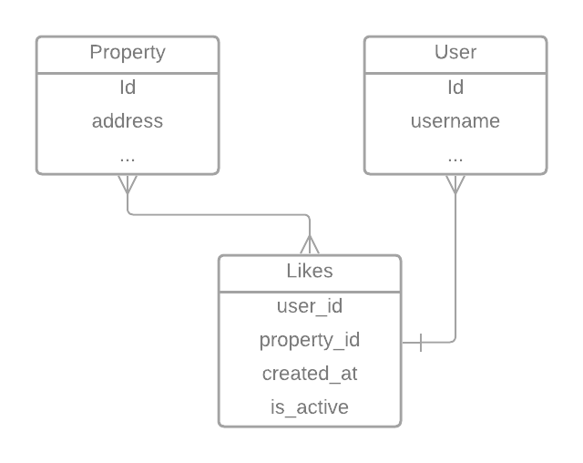

# Part two: Like service

## Requirements

* Users can like a specific property and this must be registered in the database.
* The "like" are from registered users, and the history of "likes" of each user and which properties must be registered in the database.

## Explanation





For this change we are going to use a new table called Like that is going to be
related to a User and a Property.

* **user_id**: This points to an User
* **property_id**: This points to the property that the User likes
* **created_at**: For history 
* **is_active**: We don't delete the like when the user remove the like from their account.
is necessary if we want to maintain a History of likes.

Because only we have a **created_at** field, when the user like agains the same property
is going to create a new register in the databaase, this is because we want a history of likes,
if we update the date field, we only have the last like from the user to that property.


## Query to create the new table

```SQL
CREATE TABLE like (
  id     INTEGER PRIMARY KEY, 
  updated_at   DATETIME, 
  is_active BOOLEAN,
  user_id INTEGER,
  property_id INTEGER,
  FOREIGN KEY(user_id) REFERENCES auth_user(id),
  FOREIGN KEY(property_id) REFERENCES property(id)
);
```